<h1 align="center">🔐 Auth_App — Full Stack Authentication System</h1>

<p align="center">
  A premium, complete, production-ready full stack authentication system featuring modern JWT-based flows, Google & GitHub OAuth2 social logins, and smooth React animations.
</p>

<p align="center">
  <a href="https://github.com/SurajKarande01/Auth_App/stargazers"></a>
  <a href="https://github.com/SurajKarande01/Auth_App/network/members"></a>
  <a href="https://github.com/SurajKarande01/Auth_App/issues"></a>
  <a href="https://github.com/SurajKarande01/Auth_App/blob/main/LICENSE"></a>
</p>

---

## ✨ Key Features

- **🔐 Dual Authentication Modes**: Secure credentials-based authentication (JWT) and social logins (OAuth2 via Google and GitHub).
- **🛡️ Secure Token Management**: JWT-based session security leveraging short-lived access tokens and silent refresh tokens.
- **⚡ Modern Frontend**: React 19 styled with Tailwind CSS 4, utilizing Zustand for light-weight state management and Framer Motion for premium micro-animations.
- **⚙️ Enterprise Backend**: Spring Boot 3.5 with Spring Security 6.x, Spring Data JPA, and MySQL persistence.
- **📖 Self-Documenting APIs**: Live Swagger UI playground generated via SpringDoc OpenAPI.
- **🎨 Premium Visuals**: Responsive glassmorphism cards and accessible UI design powered by Radix UI.

---

## 🛠️ Tech Stack & Badges

### 🖥️ Frontend
<p align="left">
  <a href="https://react.dev"></a>
  <a href="https://vite.dev"></a>
  <a href="https://tailwindcss.com"></a>
  <a href="https://zustand-demo.pmnd.rs"></a>
  <a href="https://framer.com/motion"></a>
  <a href="https://radix-ui.com"></a>
  <a href="https://axios-http.com"></a>
</p>

### ⚙️ Backend
<p align="left">
  <a href="https://spring.io/projects/spring-boot"></a>
  <a href="https://spring.io/projects/spring-security"></a>
  <a href="https://www.mysql.com"></a>
  <a href="https://jwt.io"></a>
  <a href="https://projectlombok.org"></a>
  <a href="https://swagger.io"></a>
</p>

---

## 📁 Project Structure

```
Auth_App/
│
├── auth-backend/              # Spring Boot Backend
│   ├── src/
│   ├── pom.xml
│   ├── Dockerfile
│   └── application.yaml
│
├── auth-front/                # React + Vite Frontend
│   ├── src/
│   ├── package.json
│   └── vite.config.js
│
└── README.md
```

---

## ⚙️ Backend Setup (Spring Boot)

### 🧩 Prerequisites
- Java 17+
- Maven 3.9+
- MySQL 8.0+

### 🧰 Steps to Run Backend

1. **Navigate to backend folder**:
   ```bash
   cd auth-backend
   ```
2. **Create a local MySQL Database**:
   ```sql
   CREATE DATABASE auth_app_dev;
   ```
3. **Database Configuration**:
   The `application-dev.yml` profile is pre-configured for local dev environment:
   ```yaml
   spring:
     datasource:
       url: jdbc:mysql://localhost:3306/auth_app_dev
       username: root
       password: root
   ```
4. **Environment Variables** *(Defaults are provided for local dev, configure as needed)*:
   ```bash
   set JWT_SECRET=your-random-long-secret
   set GOOGLE_CLIENT_ID=your-google-client-id
   set GOOGLE_CLIENT_SECRET=your-google-client-secret
   set GITHUB_CLIENT_ID=your-github-client-id
   set GITHUB_CLIENT_SECRET=your-github-client-secret
   ```
5. **Run the application**:
   ```bash
   mvnw spring-boot:run
   ```
   > 📍 Backend will be available at **http://localhost:8083**

---

## 💻 Frontend Setup (React + Vite)

### 🧩 Prerequisites
- Node.js 18+
- npm

### ⚙️ Steps to Run Frontend

1. **Navigate to the frontend directory**:
   ```bash
   cd auth-front
   ```
2. **Install dependencies**:
   ```bash
   npm install
   ```
3. **Check Environment Variables**:
   The local `.env` file is pre-configured to communicate with the backend:
   ```env
   VITE_API_BASE_URL=http://localhost:8083/api/v1
   ```
4. **Start the development server**:
   ```bash
   npm run dev
   ```
   > 📍 Frontend will be live at **http://localhost:5173**

---

## 🔗 Authentication Flow Details

```mermaid
sequenceDiagram
    autonumber
    actor User as Client (React App)
    participant Spring as Backend (Spring Security)
    participant DB as MySQL Database
    participant OAuth as Social Provider (Google/GitHub)

    rect rgb(25, 25, 35)
    Note over User,Spring: Credentials Flow
    User->>Spring: POST /api/v1/auth/login (Email, Password)
    Spring->>DB: Fetch user record & verify credentials
    DB-->>Spring: User verified
    Spring-->>User: Returns JWT Access & Refresh Tokens
    end

    rect rgb(35, 45, 55)
    Note over User,OAuth: OAuth2 Social Flow
    User->>Spring: GET /oauth2/authorization/{provider}
    Spring-->>User: Redirect to Provider Consent Screen
    User->>OAuth: Authenticate & Authorize App
    OAuth-->>Spring: Redirect to Callback with Authorization Code
    Spring->>OAuth: Exchange Code for Access Token
    OAuth-->>Spring: User Details Payload
    Spring->>DB: Create user if not exists
    Spring-->>User: Redirect to Frontend with JWT Tokens
    end
```



### 🔁 Silent Token Refresh & Logout
- **Access Tokens**: Short lifetime (e.g., 15 minutes) for optimal security, stored in memory.
- **Refresh Tokens**: Long lifetime (e.g., 7 days) stored securely in HttpOnly, SameSite, Secure cookies.
- **Silent Refresh**: The frontend triggers a refresh token request automatically right before the access token expires.
- **Logout**: Clears all tokens from client state, deletes the HttpOnly refresh cookie, and invalidates the session on the backend.

---

## 🔑 API Reference

| Method | Endpoint | Description | Auth Required |
|:---|:---|:---|:---:|
| `POST` | `/api/v1/auth/login` | Authenticate and get JWT | ❌ |
| `POST` | `/api/v1/auth/register` | Register a new user | ❌ |
| `GET` | `/api/v1/auth/current-user` | Retrieve details of current user | Session |
| `POST` | `/api/v1/auth/refresh` | Silent token refresh mechanism | 🔄 |
| `POST` | `/api/v1/auth/logout` | Logout and clear session cookies | Session |
| `GET` | `/oauth2/authorization/google` | Trigger Google OAuth2 Sign-In | ❌ |
| `GET` | `/oauth2/authorization/github` | Trigger GitHub OAuth2 Sign-In | ❌ |

---

## 🧠 Environment Configuration

| Variable | Target | Description | Example Value |
|:---|:---|:---|:---|
| `JWT_SECRET` | Backend | Hex/Base64 key to sign JWT | `c3VwZXItc2VjcmV0LWtleS1zaG91bGQtYmUtdmVyeS1sb25n` |
| `GOOGLE_CLIENT_ID` | Backend | Client ID for Google Console | `xxxx.apps.googleusercontent.com` |
| `GOOGLE_CLIENT_SECRET`| Backend | Client secret from Google | `GOCSPX-xxxxxx` |
| `GITHUB_CLIENT_ID` | Backend | OAuth App Client ID from GitHub | `Iv1.xxxxx` |
| `GITHUB_CLIENT_SECRET`| Backend | OAuth App Client Secret | `xxxxxx` |
| `VITE_API_BASE_URL` | Frontend | Target API server base URL | `http://localhost:8083/api/v1` |

---

## 🧰 Command Sheet

| Task | Category | Command |
|:---|:---|:---|
| Run Backend Dev | Backend | `mvnw spring-boot:run` |
| Build Backend JAR | Backend | `mvnw clean package` |
| Run Backend JAR | Backend | `java -jar target/Auth_App-backend-0.0.1-SNAPSHOT.jar` |
| Install Dependencies | Frontend | `npm install` |
| Run Frontend Dev | Frontend | `npm run dev` |
| Build Frontend Prod | Frontend | `npm run build` |

---

## 🚀 Deployment & Production Hardening

- **Single-Server Strategy**:
  1. Build the React project using `npm run build`.
  2. Copy the resulting static files from `dist/` into `auth-backend/src/main/resources/static`.
  3. Package the Spring Boot app and deploy the fat JAR to any Cloud VM or container.
- **Dual-Server Strategy**:
  - Deploy frontend to Vercel/Netlify, and set `VITE_API_BASE_URL` to point to production backend.
  - Deploy backend to Render, Railway, AWS, or DigitalOcean.
- **Security Audit Checklist**:
  - Always set cookies with `HttpOnly`, `Secure`, and `SameSite=Strict`/`SameSite=Lax`.
  - Enable CORS configuration strictly pointing to the production domain.
  - Protect all database credentials and API secrets in environment variables.

---

## 🧑‍💻 Author

<p align="center">
  <strong>Suraj Karande</strong><br/>
  <a href="https://github.com/SurajKarande01"></a>
  <a href="https://linkedin.com/in/suraj-karande"></a>
</p>

---

## 🪪 License

This project is licensed under the **MIT License**. See the [LICENSE](LICENSE) file for details.
